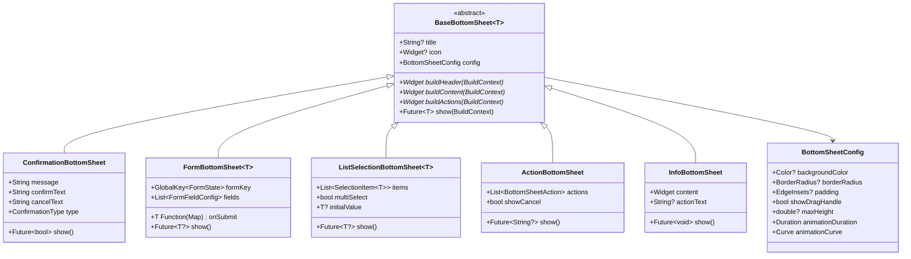

# Abstract-Based Dynamic BottomSheet System

## Architecture Overview



## Data Flow


## Bottom Sheet Types


## File Structure


```
lib/views/_widgets/bottom_sheet/
├── bottom_sheet.dart              # Barrel export
├── bottom_sheet_config.dart       # Configuration model
├── base_bottom_sheet.dart         # Abstract base class
├── confirmation_bottom_sheet.dart # Yes/No dialogs
├── form_bottom_sheet.dart         # Form input sheets
├── list_selection_bottom_sheet.dart # Single/multi select
├── action_bottom_sheet.dart       # Action menu sheets
├── info_bottom_sheet.dart         # Information display
└── bottom_sheet_extensions.dart   # BuildContext extensions
```

## Implementation Details

### 1. Configuration Model ([bottom_sheet_config.dart](lib/views/_widgets/bottom_sheet/bottom_sheet_config.dart))

```dart
class BottomSheetConfig {
  final Color? backgroundColor;
  final BorderRadius? borderRadius;
  final EdgeInsets padding;
  final bool showDragHandle;
  final double? maxHeight;
  final Duration animationDuration;
  final Curve animationCurve;
  final bool isDismissible;
  final bool enableDrag;
}
```

### 2. Abstract Base ([base_bottom_sheet.dart](lib/views/_widgets/bottom_sheet/base_bottom_sheet.dart))

Generic abstract class `BaseBottomSheet<T>` with:

- Protected `buildHeader()`, `buildContent()`, `buildActions()` methods
- Public `show(BuildContext)` method returning `Future<T?>`
- Theme integration with `AppColors` and context extensions
- Customizable via `BottomSheetConfig`

### 3. Confirmation Bottom Sheet ([confirmation_bottom_sheet.dart](lib/views/_widgets/bottom_sheet/confirmation_bottom_sheet.dart))

| Property | Type | Description |

|----------|------|-------------|

| title | String? | Header title |

| message | String | Confirmation message |

| confirmText | String | Confirm button label |

| cancelText | String | Cancel button label |

| type | ConfirmationType | normal, warning, danger, success |

| onConfirm | VoidCallback? | Optional callback |

Returns `Future<bool>` (true = confirmed, false = cancelled)

### 4. Form Bottom Sheet ([form_bottom_sheet.dart](lib/views/_widgets/bottom_sheet/form_bottom_sheet.dart))

| Property | Type | Description |

|----------|------|-------------|

| title | String? | Header title |

| fields | List of FormFieldConfig | Field definitions |

| submitText | String | Submit button label |

| onSubmit | Function | Transform form data to result |

| validator | Function? | Form-level validation |

Returns `Future<T?>` (null if cancelled, T if submitted)

### 5. List Selection Bottom Sheet ([list_selection_bottom_sheet.dart](lib/views/_widgets/bottom_sheet/list_selection_bottom_sheet.dart))

| Property | Type | Description |

|----------|------|-------------|

| title | String? | Header title |

| items | List of SelectionItem | Selectable items |

| multiSelect | bool | Allow multiple selection |

| initialValue | T? or List of T? | Pre-selected value(s) |

| searchable | bool | Enable search filter |

Returns `Future<T?>` or `Future<List<T>?>` based on multiSelect

### 6. Action Bottom Sheet ([action_bottom_sheet.dart](lib/views/_widgets/bottom_sheet/action_bottom_sheet.dart))

| Property | Type | Description |

|----------|------|-------------|

| title | String? | Header title |

| actions | List of BottomSheetAction | Action buttons |

| showCancel | bool | Show cancel button |

| cancelText | String | Cancel button label |

Returns `Future<String?>` (action id or null if cancelled)

### 7. Info Bottom Sheet ([info_bottom_sheet.dart](lib/views/_widgets/bottom_sheet/info_bottom_sheet.dart))

| Property | Type | Description |

|----------|------|-------------|

| title | String? | Header title |

| content | Widget | Custom content widget |

| icon | IconData? | Optional header icon |

| actionText | String? | Optional action button |

Returns `Future<void>`

### 8. BuildContext Extensions ([bottom_sheet_extensions.dart](lib/views/_widgets/bottom_sheet/bottom_sheet_extensions.dart))

```dart
extension BottomSheetExtensions on BuildContext {
  // Confirmation
  Future<bool> showConfirmation({...});
  Future<bool> showDeleteConfirmation({...});
  Future<bool> showWarningConfirmation({...});
  
  // Form
  Future<T?> showFormSheet<T>({...});
  
  // Selection
  Future<T?> showSingleSelection<T>({...});
  Future<List<T>?> showMultiSelection<T>({...});
  
  // Actions
  Future<String?> showActionSheet({...});
  
  // Info
  Future<void> showInfoSheet({...});
}
```

## Usage Examples

```dart
// Confirmation
final confirmed = await context.showConfirmation(
  title: 'Delete Item',
  message: 'This action cannot be undone.',
  type: ConfirmationType.danger,
);

// Form
final user = await context.showFormSheet<User>(
  title: 'Add User',
  fields: [
    FormFieldConfig.text(name: 'name', label: 'Name'),
    FormFieldConfig.email(name: 'email', label: 'Email'),
  ],
  onSubmit: (data) => User.fromMap(data),
);

// Selection
final color = await context.showSingleSelection<String>(
  title: 'Choose Color',
  items: [
    SelectionItem(value: 'red', label: 'Red'),
    SelectionItem(value: 'blue', label: 'Blue'),
  ],
);

// Action Sheet
final action = await context.showActionSheet(
  title: 'Options',
  actions: [
    BottomSheetAction(id: 'edit', label: 'Edit', icon: LucideIcons.edit),
    BottomSheetAction(id: 'delete', label: 'Delete', icon: LucideIcons.trash2, isDestructive: true),
  ],
);

// Info
await context.showInfoSheet(
  title: 'About',
  icon: LucideIcons.info,
  content: Text('App version 1.0.0'),
);
```

## Theme Integration

All bottom sheets use existing theme system:

- `context.primaryColor` for accent colors
- `context.cardColor` for backgrounds
- `context.textPrimaryColor` / `context.textSecondaryColor` for text
- `AppColors.error` / `AppColors.success` / `AppColors.warning` for types
- `kRadius` for border radius consistency